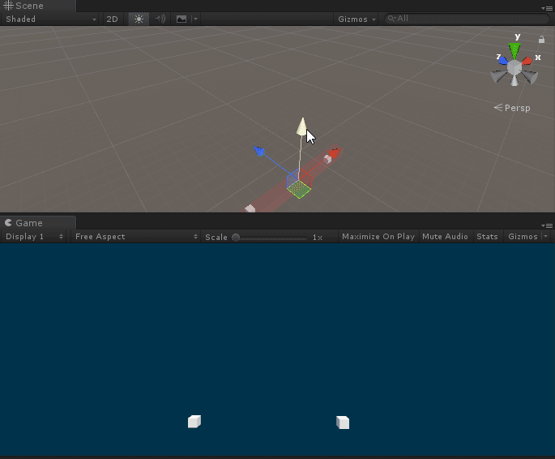

# Random Point In Area



Provide a visible area (gizmos) that can be set using the transform tool.

You can use `GetPoint()` to get a random position in the area:

```C#
GetComponent<Area>().GetPoint()
```


## How To Use

Drag RandomPointInArea folder to your Assets folder.